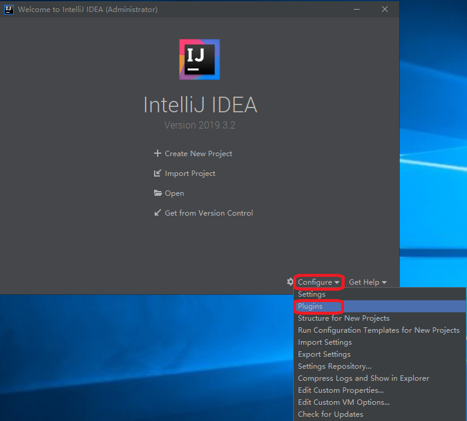
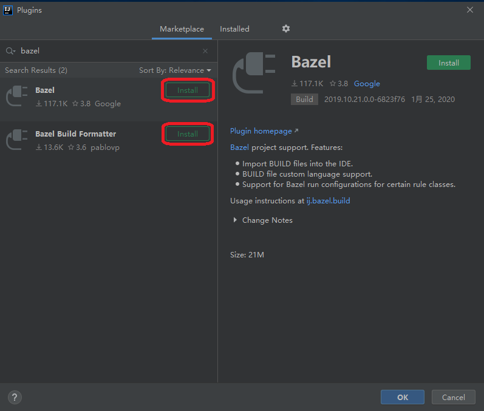
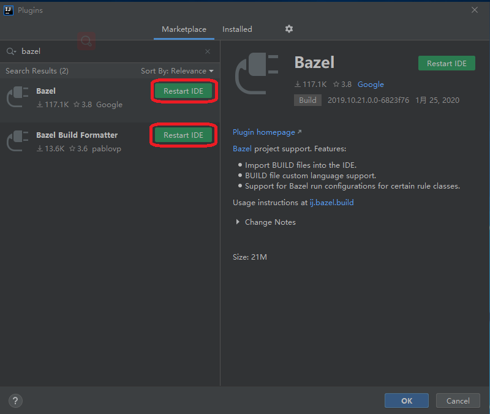
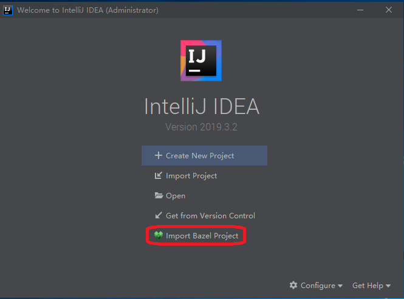
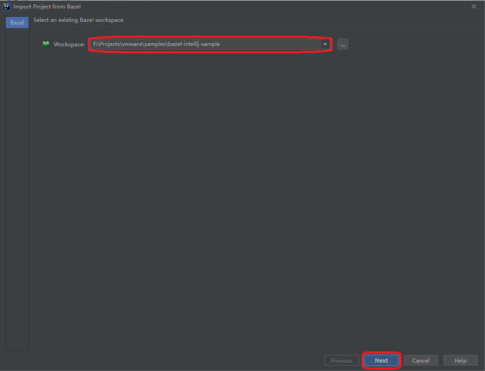
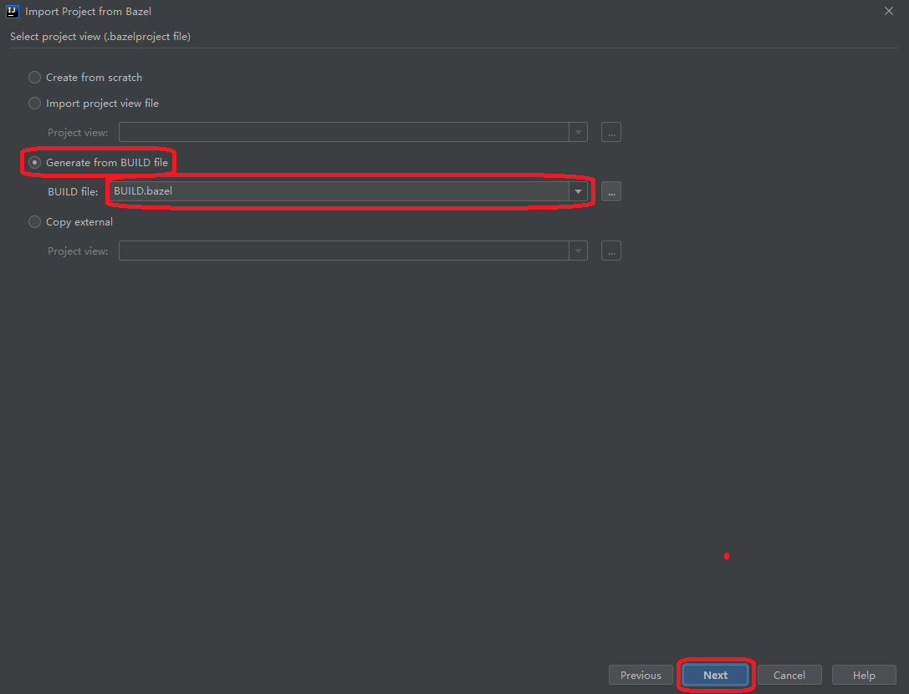
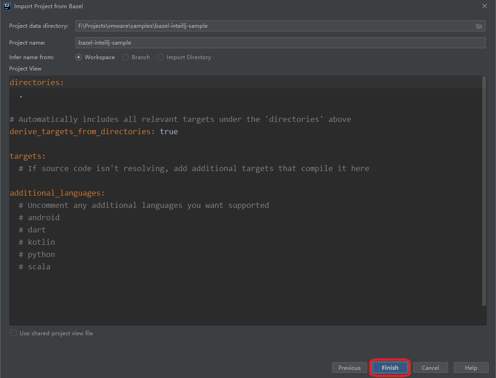

# A sample project for Spring Boot.

Build a sample project for Spring Boot based on the bazel tool in IntelliJ integrated development environment.

## Requirements

### Install java

1. Download [JDK8 for Win](https://download.oracle.com/otn/java/jdk/8u241-b07/1f5b5a70bf22433b84d0e960903adac8/jdk-8u241-windows-x64.exe)
2. Install JDK8 to the default path.
3. Set system variables:
    * JAVA_HOME=C:\Program Files\Java\jdk1.8.0_212
    * CLASSPATH=.;%JAVA_HOME%\lib\dt.jar;%JAVA_HOME%\lib\tools.jar;
    * PATH=%PATH%;%JAVA_HOME%\bin;%JAVA_HOME%\jre\bin;

### Install MSYS2

1. Download [MSYS2 for Win](http://repo.msys2.org/distrib/x86_64/msys2-x86_64-20190524.exe)
2. Install MSYS2 to the default path.
3. Set system variables:
    * BAZEL_SH=C:\msys64\usr\bin

### Install Visual C++

1. Download Visual Studio Community.
2. Install Visual Studio Community.
3. Set system variables:
    * BAZEL_VC=C:\Program Files (x86)\Microsoft Visual Studio\2019\Community\VC

### Install Bazel

1. Download [Bazel for Win](https://github.com/bazelbuild/bazel/releases/download/2.1.0/bazel-2.1.0-windows-x86_64.zip).
2. Unzip and copy `bazel.exe` to the specified path.
3. Add path of `bazel.exe` to the system variable PATH.

### Install InteillJ

1. Download [InteillJ for win](https://download.jetbrains.8686c.com/idea/ideaIC-2019.3.2.exe)
2. Install InteillJ to the default path.

## Getting Started

### Install the Bazel plugin in InteillJ

### Import project from Bazel

### Build the project using Bazel in IntelliJ

* [Swagger-UI](http://localhost:8080/swagger-ui.html)
